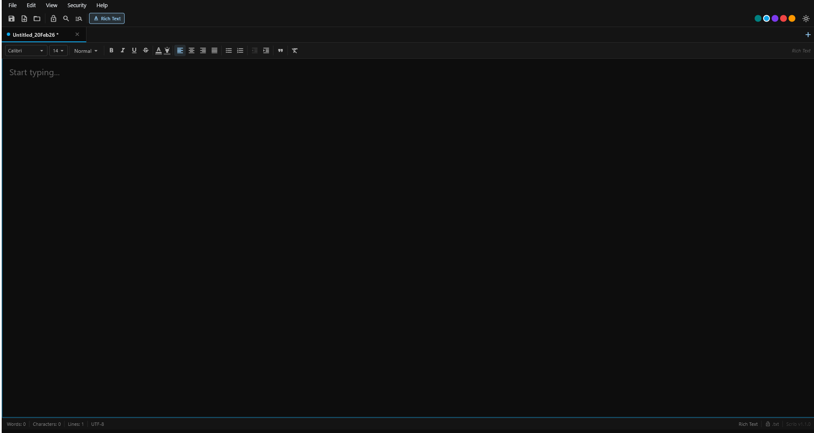

```
 ___  ___ ___ ___ ___
/ __|/ __| _ \_ _| _ )
\__ \ (__|   /| || _ \
|___/\___|_|_\___|___/
      DESKTOP
```

# Scrib Desktop

[](LICENSE)
[](https://github.com/beeswaxpat/scrib-desktop/releases)
[](https://github.com/beeswaxpat/scrib-desktop/releases)
[](https://flutter.dev/)

The encrypted desktop editor. Plain text, rich text, and `.scrb` — fully offline, zero tracking.

Built by [Beeswax Pat](https://scrib.cfd/) with [Claude Code](https://claude.ai/claude-code) · Licensed under the [GNU GPL v3](LICENSE)

**[Download Latest Release](https://github.com/beeswaxpat/scrib-desktop/releases)** · **[Blog Post](https://scrib.cfd/blog/scrib-desktop-open-source)** · **[Website](https://scrib.cfd/)**

---



---

## What Is This?

Scrib Desktop is a tabbed text editor for Windows that encrypts your files with AES-256. It handles plain text, rich text, and its own `.scrb` encrypted format. No internet connection required. No telemetry. No accounts. Your files, your keys, always.

## Features

**Editor**
- Plain text and rich text editing with per-tab mode switching (`Ctrl+M`)
- Multi-tab interface with inline rename (double-click tab), per-tab accent colors, middle-click close
- Line numbers, word wrap, persistent window position and size
- Drag and drop files onto the window to open them
- Auto-save on a configurable timer

**Rich Text**
- Bold, italic, underline, strikethrough
- Font family and size picker (14 system fonts, sizes 8–72)
- Text color palette (10 colors) and neon highlight colors (8 colors)
- Headings (H1–H3), bullet lists, numbered lists, block quotes
- Text alignment (left, center, right, justify) and indent/outdent

**Search**
- Find within current tab (`Ctrl+F`)
- Find & Replace (`Ctrl+H`)
- Search across all open tabs (`Ctrl+Shift+F`) with match counts and click-to-jump

**Encryption**
- Toggle encryption on any tab with `Ctrl+E`
- AES-256-CBC + HMAC-SHA256 (Encrypt-then-MAC)
- PBKDF2-SHA256 key derivation, 100,000 iterations
- Caps Lock warning in password dialogs
- Encryption runs in a background isolate — UI stays responsive

**File Format Support**
- **Open:** `.txt`, `.scrb`, `.rtf`, `.md`, `.log`, `.csv`, `.json`, `.xml`, `.yaml`, `.yml`, `.ini`, `.cfg`
- **Save:** `.txt`, `.scrb`, `.rtf`
- RTF import/export preserves formatting when switching between editors

**Appearance**
- Dark, Light, and System themes (Material 3)
- 16 note colors, 5 accent colors
- Adjustable text size in plain text mode (`Ctrl+=` / `Ctrl+-` / click the size number for custom input)

---

## Keyboard Shortcuts

| Shortcut | Action |
|---|---|
| `Ctrl+N` | New tab |
| `Ctrl+O` | Open file |
| `Ctrl+S` | Save |
| `Ctrl+Shift+S` | Save As |
| `Ctrl+W` | Close tab |
| `Ctrl+Tab` | Next tab |
| `Ctrl+Shift+Tab` | Previous tab |
| `Ctrl+F` | Find |
| `Ctrl+H` | Find & Replace |
| `Ctrl+Shift+F` | Search all tabs |
| `Ctrl+E` | Toggle encryption |
| `Ctrl+M` | Toggle plain text / rich text |
| `Ctrl+Z` | Undo |
| `Ctrl+Shift+Z` | Redo |
| `Ctrl+Y` | Redo (alternate) |
| `Ctrl+=` | Increase text size (plain text) |
| `Ctrl+-` | Decrease text size (plain text) |
| `Ctrl+0` | Reset text size (plain text) |
| `Escape` | Close search bar |

---

## Building from Source

**Requirements**
- [Flutter](https://flutter.dev/) 3.7+ (tested on 3.38.6)
- Windows 10 or later
- Visual Studio 2022 with the **Desktop development with C++** workload

```bash
git clone https://github.com/beeswaxpat/scrib-desktop.git
cd scrib-desktop
flutter pub get
flutter run -d windows                    # debug
flutter build windows --release           # release
```

Release binary: `build\windows\x64\runner\Release\scrib_desktop.exe`

---

## Project Structure

```
lib/
  main.dart                         Entry point, window management
  constants.dart                    Brand constants, color palettes
  providers/
    editor_provider.dart            Tab state, file I/O, search logic
  screens/
    main_screen.dart                Menu bar, shortcuts, dialogs
  services/
    file_service.dart               Disk I/O, AES-256 encryption
    settings_service.dart           Persistent settings (Hive)
    rtf_service.dart                Quill Delta <-> RTF conversion
  widgets/
    editor_widget.dart              Plain text + rich text editor
    formatting_toolbar_widget.dart  Rich text formatting toolbar
    toolbar_widget.dart             Quick-action toolbar (plain text)
    tab_bar_widget.dart             Tab bar with rename, color, close
    search_bar_widget.dart          Per-tab Find & Replace
    global_search_widget.dart       Cross-tab search panel
    status_bar_widget.dart          Word / char / line count, status
  theme/
    desktop_theme.dart              Dark and light Material 3 themes
```

15 Dart files, ~5,500 lines of code.

---

## Encryption Details

Scrib uses **Encrypt-then-MAC** with AES-256-CBC and HMAC-SHA256.

| Component | Detail |
|---|---|
| Key derivation | PBKDF2-SHA256, 100,000 iterations, 64-byte output (32 enc + 32 mac) |
| IV | 16 bytes, `Random.secure()` per save |
| Salt | 32 bytes, `Random.secure()` per save |
| HMAC | SHA-256 over `version ‖ IV ‖ salt ‖ ciphertext` |
| Key hygiene | Zeroed after use. PBKDF2 runs in a background isolate. |

`.scrb` v2 binary layout:

```
[SCRB magic 4B][version 1B][IV 16B][salt 32B][HMAC 32B][ciphertext...]
```

The HMAC is verified before decryption. Tampered files are rejected.

---

## Status Bar

The bottom bar shows: **Words** · **Characters** · **Lines** · **UTF-8** · **Plain/Rich Text** · **Encryption status**

Encrypted tabs display a gold lock icon.

---

## Menu Reference

| Menu | Items |
|---|---|
| **File** | New, Open, Recent Files, Save, Save As, Set Save Location, Close Tab |
| **Edit** | Undo, Redo, Cut, Copy, Paste, Select All, Find, Find & Replace, Search All Tabs |
| **View** | Increase/Decrease/Default Text Size, Auto-Save toggle, Theme (System/Light/Dark) |
| **Security** | Encrypt File / Decrypt File |
| **Help** | About Scrib |

---

## Dependencies

| Package | Purpose |
|---|---|
| `flutter_quill` | Rich text editor (Delta format) |
| `provider` | State management |
| `hive` / `hive_flutter` | Local settings persistence |
| `file_picker` | Native open/save dialogs |
| `window_manager` | Window title, size, position |
| `desktop_drop` | Drag and drop file support |
| `pointycastle` | AES-256-CBC, PBKDF2, HMAC-SHA256 |
| `cross_file` | Cross-platform file abstraction |

---

## Contributing

PRs welcome. See [CONTRIBUTING.md](CONTRIBUTING.md) for guidelines.

**Ground rules:** No tracking. No weakening encryption. Follow existing code style.

## License

GNU General Public License v3.0 — see [LICENSE](LICENSE).

You are free to use, modify, and distribute this software under the terms of the GPL. If you distribute modified versions, they must also be open source under the GPL.

---

*No tracking. No cloud. Just notes.*
