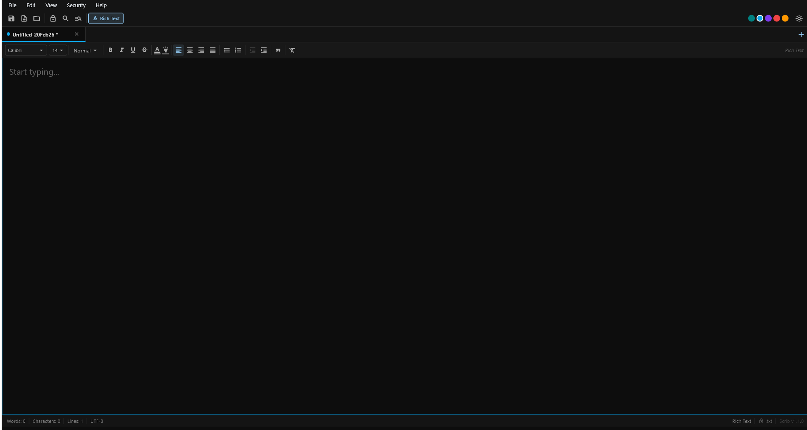
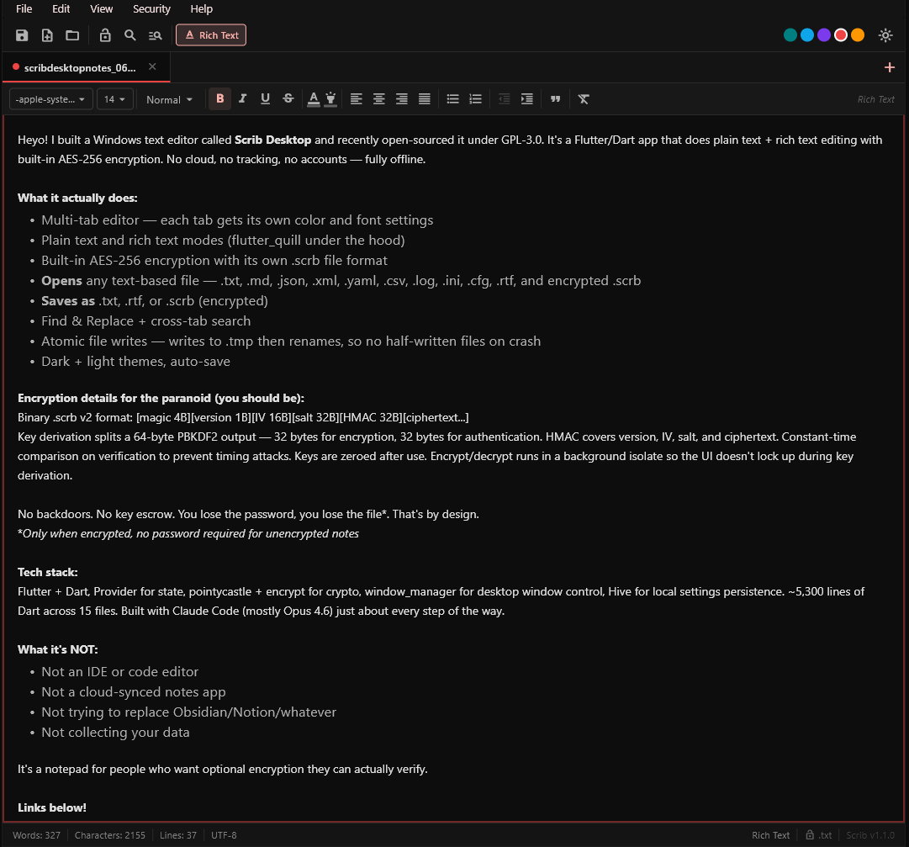

```
 ___  ___ ___ ___ ___
/ __|/ __| _ \_ _| _ )
\__ \ (__|   /| || _ \
|___/\___|_|_\___|___/
      DESKTOP
```

# Scrib Desktop

[](LICENSE)
[](https://github.com/beeswaxpat/scrib-desktop/releases)
[](https://github.com/beeswaxpat/scrib-desktop/releases)
[](https://flutter.dev/)

The encrypted desktop editor. Plain text, rich text, and `.scrb` — fully offline, zero tracking.

Built by [Beeswax Pat](https://scrib.cfd/), with [Claude](https://claude.ai) · Licensed under the [GNU GPL v3](LICENSE)

**[Download Latest Release](https://github.com/beeswaxpat/scrib-desktop/releases)** · **[Changelog](CHANGELOG.md)** · **[Blog Post](https://scrib.cfd/blog/scrib-desktop-open-source)** · **[Website](https://scrib.cfd/)**

---





---

## What Is This?

Scrib Desktop is a tabbed text editor for Windows that encrypts your files with AES-256. It handles plain text, rich text, and its own `.scrb` encrypted format. No internet connection required. No telemetry. No accounts. Your files, your keys, always.

## Features

**Editor**
- Plain text and rich text editing with per-tab mode switching (`Ctrl+M`)
- Multi-tab interface with inline rename (double-click tab), per-tab accent colors, middle-click close
- Right-click a tab for Close, Close Others, Close to the Right, Close All, and Rename
- Hover a tab to see its full file path
- Line numbers toggle (View menu), persistent window position and size
- Drag and drop files onto the window to open them
- Auto-save on a configurable timer

**Rich Text**
- Bold, italic, underline, strikethrough
- Font family and size picker (14 system fonts, sizes 8–72)
- Text color palette (10 colors) and neon highlight colors (8 colors)
- Headings (H1–H3), bullet lists, numbered lists, block quotes
- Text alignment (left, center, right, justify) and indent/outdent
- Insert images (Insert menu or the rich-text toolbar): PNG, JPEG, GIF, WebP, BMP, SVG, TIFF, TGA, ICO, PSD and more. Images are embedded in the note itself, so inside a `.scrb` they are encrypted along with the text. Large images are downscaled on insert.
- Images sit inline with text: type to the left or right, press Enter for above or below, align them, and resize or remove them on hover. The size is stored on the image and survives save and reopen.
- Insert tables: a grid picker chooses the size (up to 8 columns by 10 rows), cells are edited in place with a header row, and a hover toolbar adds or removes rows and columns. Tables are stored in the note, so inside a `.scrb` they are encrypted with the text.

**Tools**
- Built-in calculator (Insert menu or the rich-text toolbar): evaluates as you type with operator precedence, parentheses, powers, modulo and decimals, keeps a short history, and can insert the result at the cursor in either editing mode. It uses a small built-in parser, not `eval`, so a note cannot run code through it.

**Search**
- Find within current tab (`Ctrl+F`)
- Find & Replace (`Ctrl+H`)
- Search across all open tabs (`Ctrl+Shift+F`) with match counts and click-to-jump

**Encryption**
- Toggle encryption on any tab with `Ctrl+E`
- AES-256-CBC + HMAC-SHA256 (Encrypt-then-MAC)
- PBKDF2-SHA256 key derivation, 100,000 iterations
- Encrypting a file removes the plaintext original from disk (no stray copy left behind)
- Password strength meter, no-recovery reminder, and Caps Lock warning in the set-password dialog
- Encryption runs in a background isolate, so the UI stays responsive

**File Format Support**
- **Open:** `.txt`, `.scrb`, `.rtf`, `.md`, `.log`, `.csv`, `.json`, `.xml`, `.yaml`, `.yml`, `.ini`, `.cfg`
- **Save:** `.txt`, `.scrb`, `.rtf`
- RTF import/export preserves formatting when switching between editors

**Appearance**
- Dark, Light, and System themes (Material 3)
- 16 note colors, 5 accent colors
- Adjustable text size in plain text mode (`Ctrl+=` / `Ctrl+-` / click the size number for custom input)

---

## Keyboard Shortcuts

| Shortcut | Action |
|---|---|
| `Ctrl+N` | New tab |
| `Ctrl+O` | Open file |
| `Ctrl+S` | Save |
| `Ctrl+Shift+S` | Save As |
| `Ctrl+W` | Close tab |
| `Ctrl+Tab` | Next tab |
| `Ctrl+Shift+Tab` | Previous tab |
| `Ctrl+F` | Find |
| `Ctrl+H` | Find & Replace |
| `Ctrl+Shift+F` | Search all tabs |
| `Ctrl+E` | Toggle encryption |
| `Ctrl+M` | Toggle plain text / rich text |
| `Ctrl+Z` | Undo |
| `Ctrl+Shift+Z` | Redo |
| `Ctrl+Y` | Redo (alternate) |
| `Ctrl+=` | Increase text size (plain text) |
| `Ctrl+-` | Decrease text size (plain text) |
| `Ctrl+0` | Reset text size (plain text) |
| `Escape` | Close search bar |
| `F1` | Keyboard shortcuts reference |

---

## Building from Source

**Requirements**
- [Flutter](https://flutter.dev/) 3.7+ (tested on 3.38.6)
- Windows 10 or later
- Visual Studio 2022 with the **Desktop development with C++** workload

```bash
git clone https://github.com/beeswaxpat/scrib-desktop.git
cd scrib-desktop
flutter pub get
flutter run -d windows                    # debug
flutter build windows --release           # release
```

Release binary: `build\windows\x64\runner\Release\scrib_desktop.exe`

---

## Project Structure

```
lib/
  main.dart                         Entry point, window management, quit flow
  constants.dart                    Brand constants, color palettes, crypto params
  providers/
    editor_provider.dart            Tab state, file I/O, search, auto-save
  screens/
    main_screen.dart                Menu bar, shortcuts, drag-and-drop
  services/
    file_service.dart               Disk I/O, AES-256 encryption (.scrb v2/v3)
    file_operations.dart            Save / Save As decision tree
    atomic_write.dart               Windows atomic rename + crash recovery
    settings_service.dart           Persistent settings (Hive)
    rtf_service.dart                Quill Delta <-> RTF conversion
    image_embed_service.dart        Image pick / decode / downscale to data URI
    table_embed.dart                Table model + JSON codec (custom embed)
    calc_evaluator.dart             Calculator expression parser (no eval)
  dialogs/
    password_dialog.dart            Password entry / set-password dialogs (strength meter)
    about_dialog.dart               About Scrib
    confirm_dialog.dart             Unsaved-changes / confirm / font-size dialogs
    shortcuts_dialog.dart           Keyboard shortcuts reference (F1)
    calculator_dialog.dart          Built-in calculator
  widgets/
    editor_widget.dart              Plain text + rich text editor
    image_embed_builder.dart        Renders inline, resizable image embeds (raster + SVG)
    table_embed_builder.dart        Renders editable table embeds + size picker
    formatting_toolbar_widget.dart  Rich text formatting toolbar
    toolbar_widget.dart             Quick-action toolbar (plain text)
    tab_bar_widget.dart             Tab bar with rename, color, close, right-click menu
    search_bar_widget.dart          Per-tab Find & Replace
    global_search_widget.dart       Cross-tab search panel
    status_bar_widget.dart          Word / char / line count, status
  theme/
    desktop_theme.dart              Dark and light Material 3 themes
    scrib_colors.dart               ThemeExtension color palette
```

24 Dart files, ~7,400 lines of code, covered by 230+ tests.

---

## Encryption Details

Scrib uses **Encrypt-then-MAC** with AES-256-CBC and HMAC-SHA256.

| Component | Detail |
|---|---|
| Key derivation | PBKDF2-SHA256, 64-byte output (32 enc + 32 mac). v2: fixed 100,000 iterations. v3: iteration count stored per-file (so it can be raised later without breaking old files). |
| IV | 16 bytes, `Random.secure()` per save |
| Salt | 32 bytes, `Random.secure()` per save |
| HMAC | SHA-256 over `version ‖ KDF params ‖ IV ‖ salt ‖ ciphertext` (the KDF parameters are authenticated, so a downgrade is rejected) |
| Key hygiene | PBKDF2 runs in a background isolate. Key bytes are zeroed after use. |
| Atomic writes | Saves use `MoveFileExW` on Windows so a crash during save never corrupts your file. |

`.scrb` binary layout:

```
v3 (current): [SCRB 4B][version=3 1B][kdfId 1B][iterations u32-BE 4B][IV 16B][salt 32B][HMAC 32B][ciphertext...]
v2 (legacy):  [SCRB 4B][version=2 1B][IV 16B][salt 32B][HMAC 32B][ciphertext...]
```

The HMAC is verified before decryption. Tampered files are rejected. New files
are written as v3; every existing v2 file is still read by a preserved v2 code
path, so upgrading never strands a file.

### Threat model

Scrib defends against:
- Someone with read access to your `.scrb` files but not your password
- File tampering (HMAC covers the version byte, IV, salt, and ciphertext)
- Disk-level corruption during a save (atomic rename protects existing files)

Scrib does **not** defend against:
- A compromised machine: a key-logger, RAM dump, or malicious Flutter build can recover
  the password while a file is open. Passwords are held in memory as `String` for the
  lifetime of an open encrypted tab — Dart strings are immutable and can't be securely
  zeroed, so the password may linger in the heap until garbage collection.
- Brute force against weak passwords. PBKDF2 with 100k iterations buys time but not
  infinity. Use a long, high-entropy password.
- File path / filename leakage: `recentFiles`, window position, and default save
  location are stored in a plaintext Hive box under `%APPDATA%`. Future versions
  may encrypt this; today the contents of your notes are encrypted, but the
  *names* and *paths* of your notes are not.

---

## Status Bar

The bottom bar shows: **Words** · **Characters** · **Lines** · **UTF-8** · **Plain/Rich Text** · **Encryption status**

Encrypted tabs display a gold lock icon.

---

## Menu Reference

| Menu | Items |
|---|---|
| **File** | New, Open, Recent Files, Save, Save As, Set Save Location, Close Tab |
| **Edit** | Undo, Redo, Cut, Copy, Paste, Select All, Find, Find & Replace, Search All Tabs |
| **Insert** | Image (rich text mode), Table (rich text mode), Calculator |
| **View** | Increase/Decrease/Default Text Size, Line Numbers toggle, Auto-Save toggle, Theme (System/Light/Dark) |
| **Security** | Encrypt File / Decrypt File |
| **Help** | Keyboard Shortcuts, About Scrib |

---

## Dependencies

| Package | Purpose |
|---|---|
| `flutter_quill` | Rich text editor (Delta format) |
| `flutter_svg` | Renders SVG image embeds |
| `image` | Decodes and downscales image formats on insert |
| `provider` | State management |
| `hive` | Local settings persistence |
| `file_picker` | Native open/save dialogs |
| `window_manager` | Window title, size, position |
| `desktop_drop` | Drag and drop file support |
| `pointycastle` | AES-256-CBC, PBKDF2, HMAC-SHA256 |
| `ffi` | Windows `MoveFileExW` for atomic rename |

---

## Contributing

PRs welcome. See [CONTRIBUTING.md](CONTRIBUTING.md) for guidelines.

**Ground rules:** No tracking. No weakening encryption. Follow existing code style.

## License

GNU General Public License v3.0 — see [LICENSE](LICENSE).

You are free to use, modify, and distribute this software under the terms of the GPL. If you distribute modified versions, they must also be open source under the GPL.

---

*No tracking. No cloud. Just notes.*
